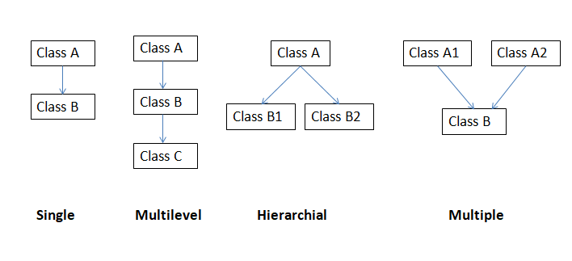

# Object-Oriented-Programming in Python:
**Object Oriented Programming:** It is a methodology to design a program using classes and objects.      

**Class:** It is a logical entity which is a blueprint/template that describes the details of an object.

**Object:** It is a real-word entity which is an instance of the class.             

**Empty class:** An empty class can be created using pass keyword.           

**Constructor:** It is a special method that is used to initialize an object and allocate memory to it. __init__() is a constructor in python
    An object cannot be created without a constructor. If we don't define it, python defines it.   
    **Two types:**      
    - **Default Constructor:** Constructor that doesn't accept any arguments during the object creation.    
    - **Parameterized:** Constructor that accepts arguments during the object creation.
    
**Self:** It is a pointer that points to the object of the class
  - In __init__() method, it refers to the newly created object. In other methods, it refers to the object whose method was called.

# Features of OOPs:
  - Inheritance
  - Polymorphism
  - Abstraction
  - Encapsulation
  
### Inheritance:
It is a way of creating a new class using the details of an existing class without modifying it.
New class is called as a child/derived class and the existing class is called as a parent/super class.

#### Types:
- **Single Inheritance:** Class inherits only one super class
- **Multilevel Inheritance:** Class which inherits a super class will be inherited by another class forming a parent,child and grandchild relationship.
- **Hierarchial Inheritance:** Super class will be inherited by multiple derived classes
- **Multiple Inheritance:** Class inherits multiple super classes
- **Hybrid Inheritance:** It is a combination of Multilevel and Multiple inheritance.
 

**Polymorphism: ** Poly means multiple and morph means forms i.e polymorphism is nothing but ability to handle multiple forms.   
Types of polymorphism:  
**Compile time/Static Polymorphism:** Compiler itself determines which method should be called. Eg: Method Overloading     
**Run time/Dynamic Polymorphism:** Compiler cannot determine the method that has to be called at compile time. It is resolved at runtime. Eg: Method Overriding    
Note: Compile time is the time at which the source code is converted to an executable code. Runtime is the time at which the executable code is started running  

**Abstraction:** It is the process of displaying only essential information and hiding details.   

**Encapsulation:** It is the process of wrapping data into single unit and preventing direct modification of the data by restricting access to attributes and methods.   
It can be achieved using private variables. In python there is no keyword named 'private', it achieves it using atleast two preceding underscores or one trailing underscore.

__a or a_

